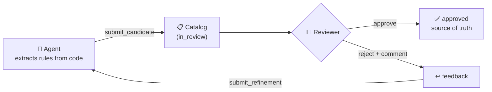
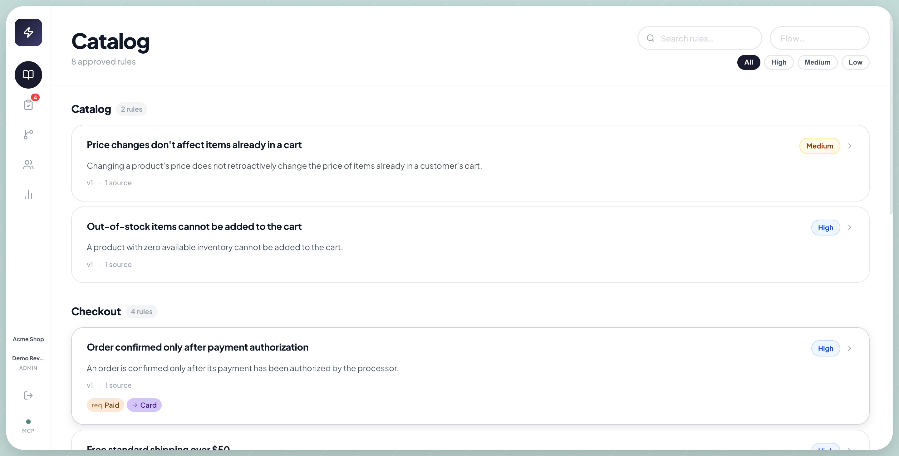
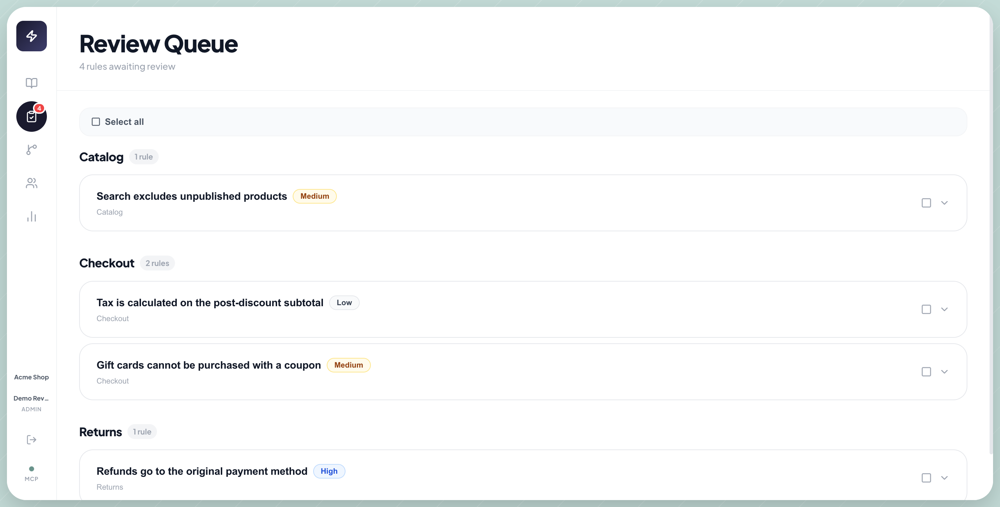
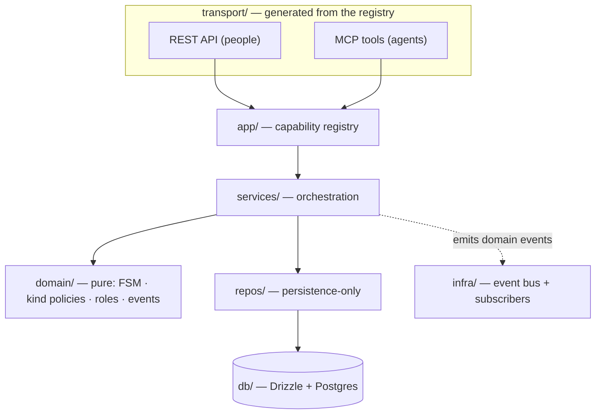

<div align="center">

# 🧠 Lore

**A knowledge base that corrects itself.**

AI agents extract business rules from your code, humans approve or reject them,
and rejected rules feed back to the agent for refinement — a loop that *converges* on the truth.

[](https://github.com/eliasem-ka/lore-oss/actions/workflows/ci.yml)
[](LICENSE)
[](https://www.typescriptlang.org/)
[](CONTRIBUTING.md)

</div>



The business rules of a company live buried inside code — conditions, validations, edge
cases that only their authors remember. **Lore surfaces them into a living, governed catalog**:
agents propose, humans decide, and the catalog becomes the source of truth that both people
and other agents can trust.

---

## Table of contents

- [Why Lore](#why-lore)
- [Screenshots](#screenshots)
- [Quickstart](#quickstart)
- [Connect an MCP client](#connect-an-mcp-client)
- [Architecture](#architecture)
- [MCP tools](#mcp-tools)
- [Documentation](#documentation)
- [Contributing](#contributing)
- [License](#license)

---

## Why Lore

| Without Lore | With Lore |
|---|---|
| Business logic scattered across thousands of lines, known only to a few people, in docs nobody updates. | A living catalog of rules — each explained in **business** *and* **technical** language, reviewed by humans, kept current by AI agents. |

Two things make it different from "AI that writes docs":

1. **A converging human-in-the-loop.** Nothing is approved without an explicit human verdict; rejections (with a required comment) flow back to the agent, which refines and resubmits. Each lap produces sharper rules.
2. **Agents are first-class producers.** They connect over **MCP** (Model Context Protocol) — the same tools and methodology are exposed to any agent (Claude, Cursor, …), with no bespoke integration.

**Stack:** Node/Express · Drizzle ORM · Postgres + pgvector · MCP SDK · React/Vite

---

## Screenshots

<table>
<tr>
<td width="50%" valign="top">
<b>Catalog</b> — approved rules, grouped by flow, with confidence and entity links.

</td>
<td width="50%" valign="top">
<b>Review queue</b> — rules awaiting a human verdict: approve, reject, or ask for clarification.

</td>
</tr>
</table>

> Want to see this live? The [Quickstart](#quickstart) below loads exactly this demo data in one command.

---

## Quickstart

**Prerequisites:** Node 20+, Docker (for Postgres).

```bash
# 1. Start Postgres (with pgvector)
docker compose up postgres -d

# 2. Server — install, migrate, run
cd server
npm install
cp ../.env.example .env            # edit DATABASE_URL if needed
npm run db:migrate
npm run dev                        # Express on http://localhost:3000

# 3. Client — in a second terminal
cd client
npm install
npm run dev                        # Vite on http://localhost:5173
```

Open **http://localhost:5173** — the UI proxies `/api` and `/mcp` to port 3000.

### Load the demo data (optional)

To populate the e-commerce catalog shown in the [screenshots](#screenshots) above:

```bash
cd server
npm run seed:demo
```

Then log in at **http://localhost:5173** with:

| Email | Password |
|---|---|
| `demo@acme.test` | `demodemo123` |

---

## Connect an MCP client

Add to your `.mcp.json` (Claude Code, Cursor, etc.):

```json
{
  "mcpServers": {
    "lore": { "type": "http", "url": "http://localhost:3000/mcp" }
  }
}
```

Then prompt the agent:

> Use the `extract_rules` prompt from the `lore` MCP server and run a full extraction round against the Checkout flow.

---

## Architecture

Lore is a **layered monolith** — each layer knows only the one below. State and invariants
live in the pure `domain/` + `services/` core; the transports and side-effects bolt on around it.



Highlights worth a look:

- **One capability registry → two transports.** Each capability is declared once; the REST router and the MCP tools are *generated* from it, with a parity test that fails if they ever drift.
- **The lifecycle is a data table.** State transitions live in `domain/fsm.ts` as a transition table — not scattered `if`s — so an invalid jump is impossible by construction.
- **Hybrid search.** Local multilingual embeddings (`multilingual-e5-small`, 384-dim, *no external API*) fused with Postgres full-text search via Reciprocal Rank Fusion — query in any language, find rules written in another.
- **Multi-tenant isolation.** Every tenant query is scoped by `workspace_id`; a cross-tenant read is indistinguishable from not-found.
- **Side-effects via an event bus.** Webhooks, Jira tickets and audit logs attach as subscribers — emission never changes a handler's result.

> The architectural rules are **written down and enforced by tests** — see [`docs/CONSTITUTION.md`](docs/CONSTITUTION.md) and the deeper [`docs/ARCHITECTURE.md`](docs/ARCHITECTURE.md).

---

## MCP tools

| Tool | Description |
|---|---|
| `start_round` | Begin an extraction session (declares scope to avoid overlap) |
| `submit_candidate` | Submit a discovered rule (merges into a new version if `rule_key` exists) |
| `search_catalog` | Search approved rules (hybrid lexical + semantic) |
| `list_pending_feedback` | Get rejected rules awaiting agent refinement |
| `submit_refinement` | Submit an updated version, resolving feedback |
| `get_rule` | Full rule with version history and feedback |
| `complete_round` | Close an extraction session |

Prompt: `extract_rules` — ships the full tool-aware extraction methodology to the agent.

---

## Documentation

- 📐 [`docs/ARCHITECTURE.md`](docs/ARCHITECTURE.md) — the layered design, in depth.
- 📜 [`docs/CONSTITUTION.md`](docs/CONSTITUTION.md) — the non-negotiable invariants (enforced by tests).
- 🧭 [`docs/recorrido-lore.html`](docs/recorrido-lore.html) — a non-technical, self-contained walkthrough (product tour + concept deep-dives on MCP, the modules, the FSM, the event bus, multi-tenancy and embeddings). Open it in a browser.
- 🗺️ [`ROADMAP.md`](ROADMAP.md) — what's done and what's next.

---

## Contributing

Contributions are welcome under the AGPL-3.0 license. Please read
[`CONTRIBUTING.md`](CONTRIBUTING.md) — the architecture is a contract, and a few invariants
are enforced by tests that must stay green.

---

## License

Licensed under the **GNU Affero General Public License v3.0** ([AGPL-3.0](LICENSE)).

Lore is free and open source — use it, study it, modify it, self-host it. The AGPL adds one
obligation that matters here: **if you run a modified version as a network service, you must
publish your modified source under the same license.** This keeps the project open and
prevents it from being taken closed and resold as a proprietary hosted product.

© 2026 Elias Eguizabal. Contributions are accepted under the same license.
