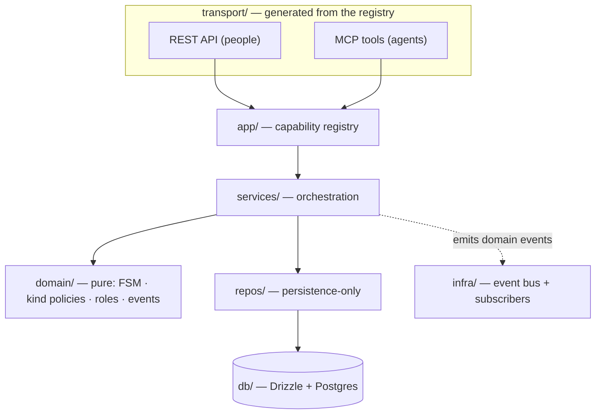

# Architecture

Lore is a **layered monolith**. The rule that holds the whole thing together: **each layer
knows only the one below it**, and all state transitions and invariants live in the pure
`domain/` + `services/` core — never in a transport, an MCP tool, a React component, or SQL.

## The layers

| Layer | Path | Responsibility | Knows about |
|---|---|---|---|
| **transport** | `server/src/transport/` | Translate HTTP/MCP requests; enforce auth; resolve `ctx` (user, workspace). **Generated** from the registry. | app |
| **app** | `server/src/app/` | The **capability registry** — one declaration per capability. Thin handlers that adapt to services and emit events. | services |
| **services** | `server/src/services/` | Orchestration: dedup→version, source-overlap, scope-conflict, search fusion. | domain, repos |
| **domain** | `server/src/domain/` | Pure logic, no DB: the FSM lifecycle, per-kind policies, roles, event types. | nothing |
| **repos** | `server/src/repos/` | Persistence only — rows in, rows out. No domain rules. | db |
| **infra** | `server/src/infra/` | The in-process event bus + subscribers (webhook, Jira, audit log). | domain (event types) |
| **db** | `server/src/db/` | Drizzle schema + migrations. | — |

## Five ideas worth understanding

### 1. One capability registry → two transports

Every action is declared once with `defineCapability` (`app/capabilities/*`). From that single
declaration, **both** the REST router and the MCP tools are *generated* — nobody hand-writes
routes or tool lists. A **parity test** (`app/parity.test.ts`) fails the build if an action
exists on one transport but not the other (unless it's explicitly allow-listed with a rationale).

The only thing that differs per transport is presentation: REST returns JSON; MCP renders a
**guidance-rich text** for the agent (e.g. `submit_candidate` tells the agent *"this overlaps an
existing rule — pass its `rule_key` to version instead of duplicating"*).

### 2. The lifecycle is a data table

A knowledge unit moves through states (`draft → in_review → approved | rejected |
needs_clarification`). Those transitions live in `domain/fsm.ts` as a **transition table** with
guards — not scattered `if`s. Because the legal moves are *data*, an invalid jump is impossible
by construction, and the whole lifecycle is covered by table tests.

A core product invariant rides on top: **only an explicit human verdict yields `approved`**.
High-confidence architecture units may auto-`published`, but `published ≠ approved` — publishing
is a machine action, approving is human-only.

### 3. Per-kind policies (Open/Closed)

The catalog stores multiple **kinds** of knowledge (`business_rule`, `architecture`). Rather than
`if (kind === …)` branching, each kind implements a set of small policy interfaces
(`domain/kinds/*`): how it computes status, validates, indexes, snapshots, and builds its content.
Ingestion (`ingestUnit`) is fully kind-agnostic — adding a new kind means adding a policy, not
editing switch statements.

### 4. Hybrid, multilingual search

Search fuses two retrievers and blends them with **Reciprocal Rank Fusion**:

- **DENSE** — cosine distance over local multilingual embeddings (`multilingual-e5-small`,
  384-dim, run in-process with no external API). Cross-lingual: a Spanish query finds an
  English rule.
- **SPARSE** — Postgres full-text search in the `simple` config (no stemming), so exact code
  identifiers like `SKU4471` survive.

If the model can't embed (disabled or unavailable), search degrades gracefully to sparse-only —
never a hard failure. Vectors never cross the API boundary: agents send text, Lore embeds.

### 5. Side-effects via an event bus

Handlers emit **domain events** (`VerdictSubmitted`, `UnitPublished`, …) *after* a successful
operation. Subscribers in `infra/subscribers/*` react — a webhook, a Jira ticket, an audit log —
independently and best-effort. Emission must **never** change a handler's return value, and new
integrations attach as new subscribers without touching service logic.

> **Known limitation:** the bus is in-process and at-most-once. For a side-effect that must never
> be lost, a transactional outbox would be the upgrade — see the constitution's notes.

## Tenancy

`projects`, `knowledge_units`, and `rounds` carry a denormalized `workspace_id`, and **every**
tenant query filters on it. `ctx.workspaceId` is resolved per request (REST: from the JWT user +
an `X-Workspace-Id` header validated against membership; MCP: per session). A cross-tenant read by
id is indistinguishable from not-found — it never leaks existence. The behavioral proof lives in
`services/tenantIsolation.test.ts`.

## The constitution

The invariants above aren't conventions — they're enforced. See
[`CONSTITUTION.md`](CONSTITUTION.md) for the full, versioned list and the tests that guard it.
